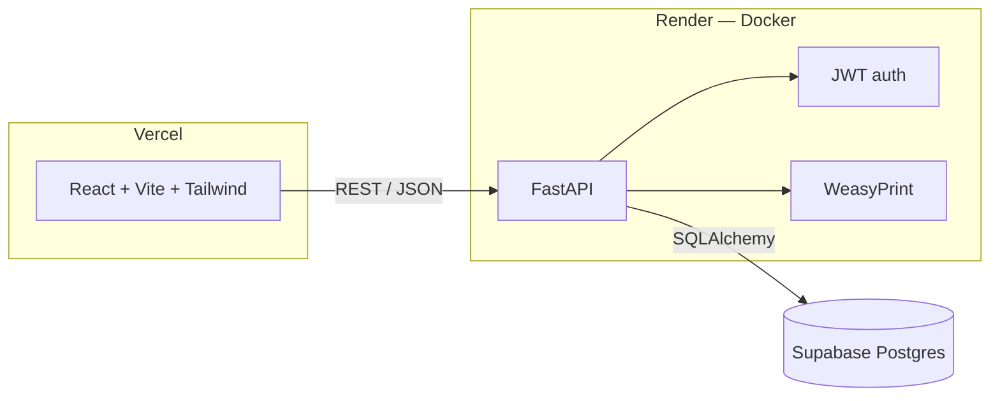

# LA County Parks — Grants Management System

Internal grants tracking tool for the LA County Parks & Recreation Grants
Administration section. Replaces a patchwork of spreadsheets and SharePoint
folders with a single app for tracking active/closed grants, deed
restrictions, awarded grants, and periodic status report (PSR) due dates —
with role-based access, a full audit trail, and restore-from-deletion built
in throughout.

<p>
  
  
  
  
  
  
  
  
  <br>
  
  
  
  
  
  
</p>

## What it does

| Module | Summary |
|---|---|
| **Dashboard** | Active/closed grant counts, total active funding, awards total, PSRs due soon, expiring-grants and due-soon-PSR tables with 7d/14d/1mo/past-due toggles |
| **All Grants** | Full grant roster with Active/Closed tabs, per-column checkbox filters, sorting, pagination, update-note history, PDF snapshot export |
| **Status Reports (PSR)** | Tracks periodic status report due dates per grantor category (RPOSD, State of CA NRA, Conservancy, Cooling Amenities/Fairfax, Other + custom), multiple due dates per project, submitted tracking, note history, 30/14/7-day reminders |
| **Grants Awarded** | Separate award log (project, grantor, date, amount) with a PDF summary report |
| **Deed Restrictions** | Recorded/Draft tracking with SharePoint document links |
| **Property Lookup** | Jumps straight to an LA County Assessor record by AIN |
| **Photo Summary Template** | Generates a branded Word doc from 2–6 uploaded project photos |
| **Links & Tools** | Curated shortcuts to park GIS maps, district maps, and grant-eligibility/equity data tools |
| **Admin** | Invite links (role-scoped, no email dependency), user management, and a full change log with one-click restore for any deletion |

Every create/update/delete anywhere in the app writes to an append-only
audit log. Deletions of grants, notes, awards, deed restrictions, and PSR
projects are restorable from **Admin → Change Log** — nothing is ever
silently gone.

## Architecture



Auth is fully custom (no Supabase Auth SDK): short-lived access tokens in
the `Authorization` header, a longer-lived refresh token in an httpOnly
`SameSite=None; Secure` cookie (required since the frontend and API are on
different origins).

## Tech stack

**Backend** — FastAPI · SQLAlchemy 2.0 · Alembic · Pydantic v2 · psycopg3 ·
python-jose (JWT) · bcrypt · WeasyPrint (PDF) · python-docx + Pillow (Word
doc generation) · openpyxl (spreadsheet imports)

**Frontend** — React 18 · Vite · Tailwind CSS · TanStack Query · React
Router · Axios

**Data** — Supabase-hosted Postgres, accessed directly via SQLAlchemy (not
through the Supabase client SDK)

**Deploys** — Backend as a Docker image on Render; frontend as a static
Vite build on Vercel. Both auto-deploy on push to `main`.

## One-time setup

### 1. Environment variables

Copy `.env.example` to `.env` at the repo root and fill in real values:

```
DATABASE_URL=
JWT_SECRET=
ALLOWED_INVITE_DOMAIN=parks.lacounty.gov
FRONTEND_URL=http://localhost:5173
```

Also copy `frontend/.env.example` to `frontend/.env` (sets `VITE_API_URL`,
defaults to `http://localhost:8000`).

### 2. Backend — install & migrate

**Use Python 3.12**, not 3.14 — several dependencies (notably `pydantic-core`)
don't yet ship prebuilt wheels for 3.14, which forces a from-source Rust build
that is likely to fail on a locked-down machine.

```
cd backend
py -3.12 -m venv .venv
.venv\Scripts\pip install -r requirements.txt
.venv\Scripts\alembic upgrade head
```

### 3. Seed the first admin user + System Import user

```
.venv\Scripts\python ..\scripts\seed_admin.py --email you@parks.lacounty.gov --name "Your Name" --password "at-least-8-chars"
```

Safe to re-run — skips users that already exist.

### 4. Import data (optional — one-off scripts, see `scripts/`)

| Script | What it imports |
|---|---|
| `import_grants.py <csv>` | Active/closed grants from the master CSV export |
| `import_deed_restrictions.py <xlsx>` | Deed Restriction Log, pulling real SharePoint links from cell hyperlinks |
| `import_psr_log.py <xlsx>` | PSR Tracking Log across all grantor-category sheets |
| `sync_grants_from_master_log.py <xlsx> [--apply]` | Reconciles the grants table against an updated master log — dry-run by default, reports adds/updates/removes before touching anything |
| `backfill_sharepoint_links.py` | Fuzzy-matches grants to a SharePoint folder listing |

All of these are idempotent (safe to re-run) and print a summary of what
changed. Place source files outside the repo (they're internal county data)
and pass the path as an argument.

### 5. Run the backend

```
cd backend
.venv\Scripts\uvicorn app.main:app --reload --port 8000
```

### 6. Run the frontend

```
cd frontend
npm install
npm run dev
```

Visit `http://localhost:5173`.

## Known environment caveat: WeasyPrint on Windows

The PDF export endpoints use WeasyPrint, which depends on the native GTK3
libraries (Pango/Cairo/GObject) for text layout. These aren't bundled by pip
on Windows and installing them requires the GTK3 runtime installer, which
needs administrator rights. This doesn't affect Linux/Docker deployments
(`apt install libpango-1.0-0 libcairo2` is all that's needed there) — it's a
Windows-local-dev-only issue, and the import is lazy so nothing else in the
app breaks if GTK3 isn't installed.

To test PDF export locally on Windows, install the GTK3 runtime (requires
admin): download from
https://github.com/tschoonj/GTK-for-Windows-Runtime-Environment-Installer/releases
and run the installer normally, then restart your terminal.

## Status computation

Grant status is never stored — it's computed at query/render time:

```
if withdrawn:                   "Withdrawn"
elif status_override is set:    that value
elif current_exp_date < today:  "Closed"
else:                           "Active"
```

`status_override` and `withdrawn` are manual overrides, toggled from the
Grant Detail page (admin/editor only).

## Permission matrix

| Action | Admin | Editor | Viewer |
|---|---|---|---|
| View dashboard/grants/detail | ✓ | ✓ | ✓ |
| Edit grant/deed restriction/PSR/award fields | ✓ | ✓ | ✗ |
| Add update-history notes | ✓ | ✓ | ✗ |
| Download PDF snapshots/reports | ✓ | ✓ | ✓ |
| Delete grants/notes/awards/deed restrictions/PSR projects | ✓ | ✗ | ✗ |
| Restore a deletion from the Change Log | ✓ | ✗ | ✗ |
| Invite/manage/delete users | ✓ | ✗ | ✗ |

Enforced on the backend (403s via `require_editor`/`require_admin`
dependencies) and mirrored in the frontend (buttons/inputs hidden per role).

## Data integrity notes

- **User deletion never destroys history.** `GrantNote.author_name` and
  `AuditLog.user_name` are permanent snapshots captured at write time; the
  underlying `user_id` foreign keys are nullable with `ON DELETE SET NULL`,
  so deleting a user account leaves every note and change-log entry intact.
- **Invites are link-based, not email-based.** Admins generate a
  role-scoped set-password link and share it themselves — there's no
  dependency on transactional email deliverability for onboarding.
